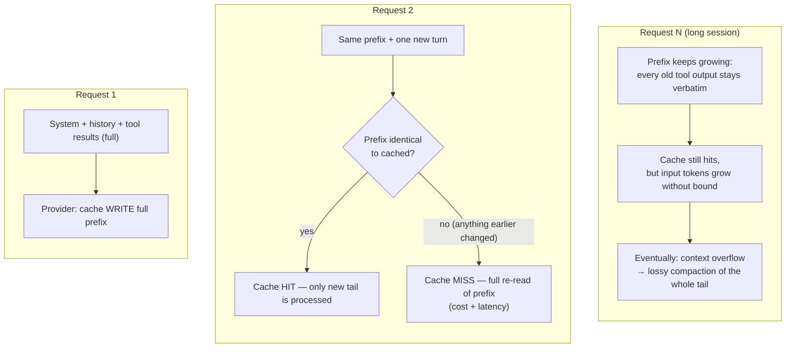
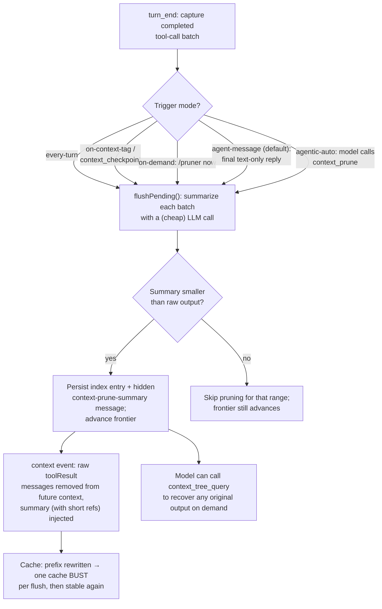
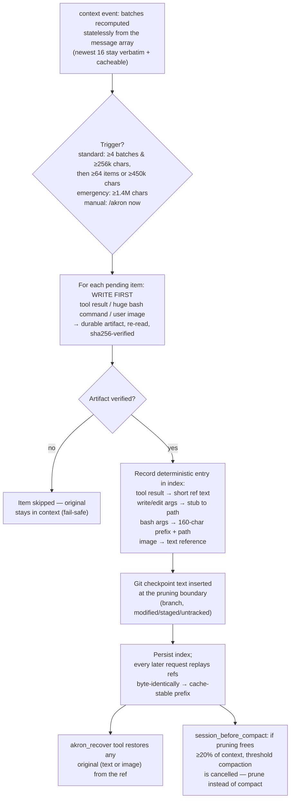

# pi-akron-prune

Lossless context pruning for [pi](https://github.com/earendil-works/pi/blob/main/packages/coding-agent): completed tool
activity and uploaded images are written to **durable, hash-verified artifacts** on disk
and replaced in the outgoing LLM context with short, deterministic references. No
summarizer model, no lossy compaction — and the session file is **never modified**,
so nothing is ever actually lost.

Based on the works of [tbo](https://github.com/tbo)

## How it works

### Batching

Completed tool activity and uploaded images form *batches* — one batch per assistant
message that issued tool calls, or per user message that uploaded images. The protected
working set keeps up to the newest 16 eligible batches, bounded by a 320k-character
budget while always retaining at least 2 newest batches. Older content becomes pruning
candidates. A batch is only *complete* once a later assistant message has consumed it,
which protects unprocessed tool output and user images.

### Triggers

| Trigger | Condition |
| --- | --- |
| Standard | ≥ 4 pending batches **and** ≥ 256k pending chars, **followed by** ≥ 64 items **or** ≥ 450k chars |
| Pressure | remaining context capacity drops below 12%; selects enough eligible content to target 20% free context |
| Emergency | ≥ 1.4M pending chars, still preserving the configured working-set floor |
| Manual | `/akron now` |
| Pre-compaction | A threshold-time prune defers compaction for one provider request; pruning replaces compaction when it frees ≥ 20% |

The one-request deferral lets pi measure the rewritten context instead of immediately reusing stale pre-prune usage. If the measured context still exceeds pi's threshold, normal compaction proceeds on the next check. Routine thresholds are characters; pressure thresholds use the active model context window. Every threshold is configurable
(`~/.pi/agent/akron-prune/settings.json`).

### Pruning

For each pending item, **write first, rewrite second**:

- **Tool results** → text and image blocks are written to directly readable artifact
  files in their original order, re-read and verified by sha256, and useful historical outputs are replaced in context with
  `[akron-pruned: bash result (~5k chars) — original saved to <path>. Recover with the
  akron_recover tool (ref=<id>) or read the file.]`
- **Consumed redundant evidence** → earlier repeated reads, superseded `write`/`edit`
  activity, and processed browser screenshots remove both the tool call and matching
  tool result from outgoing context. Surrounding assistant reasoning stays visible;
  exact call arguments and results are still persisted as artifacts even when no
  individual reference is left in context.
- **File mutations** (`write`/`edit`) that are not removed → the tool-call arguments
  (which carry the bulk content) are saved as artifacts and stubbed down to `{path, …}`.
  The workspace already contains the result.
- **Huge bash commands** (> 800 chars) → the full command is artifacted, the in-context
  copy keeps a 160-char prefix plus the artifact path.
- **Uploaded user images** → persisted as artifacts, replaced with a text reference; the
  surrounding user text stays visible.

If an artifact cannot be written or does not verify, **that item is skipped and stays in
context** — pruning fails rather than silently discarding content. Because the session
file always holds the originals, a later artifact loss is also graceful: entries whose
artifacts are missing/mismatched are dropped at startup and the original content simply
stays in context.

### Checkpoints

Each prune event inserts a compact checkpoint at the pruning boundary describing the
git state at that moment (branch, modified/staged files, and untracked files — the
"changes outside git") plus what was pruned. Checkpoints are part of the persisted
index, so they replay deterministically on every request.

### What is never pruned

- Unconsumed output (no later assistant continuation yet)
- The configured newest working set
- Results below `minResultChars` (~120 chars) — a reference wouldn't save anything
- `read` results for markdown files (`.md`, `.mdx`) — working instructions stay in
  context verbatim
- Skills and injected context (custom messages are never touched)

## Recovery

The `akron_recover` tool restores any pruned output on demand — text, images, or
artifacted mutation arguments — from the ref shown in the placeholder, a known tool
call id, or an indexed artifact path. Append `:pair` to a removed tool-call id to
recover the archived call followed by its result; ordinary recovery returns only the
original result or arguments. Requiring index metadata keeps recovery hash-verified;
paths outside the session's artifact store or no longer present in the index are
rejected. Text artifacts can also be read directly with the normal `read` tool.

## Commands

| Command | Effect |
| --- | --- |
| `/akron status` | Config, session, pending backlog, pruned totals |
| `/akron on` / `/akron off` | Enable/disable |
| `/akron now` | Prune all pending batches immediately |
| `/akron gc` | Remove artifacts of sessions older than `retentionDays` that no longer exist |
| `/akron` | Help |

A compact footer status line shows recent observed cache-hit rate, cache-read tokens,
estimated token headroom before threshold compaction, and the pending prune backlog
when `showStatus` is on, for example
`↻95.6% ⧉43.3M ⏳128k ✂12/301k`. Compaction headroom uses pi's default
reserve-token threshold, so it is a token-distance estimate rather than a wall-clock
ETA. `/akron status` also reports the exact footer text and the number of recent
cache records loaded for the active session.

## Profiling

Every prune event appends a line to `~/.pi/agent/akron-prune/profile.jsonl`:
trigger, batches/items, chars pruned vs. chars added back (references + checkpoints),
failures, duration. Completed assistant responses with usage append observed provider
cache metrics to `~/.pi/agent/akron-prune/cache-profile.jsonl`: input/output tokens,
cache-read/cache-write tokens, cost when reported, provider/model, and the active
pruned-entry snapshot. Analyze both with the bundled report:
`bun run analyze-profile.ts` (add profile/cache-profile path args to analyze other
files, `--json` for machine output) — it reports net savings, reference overhead,
trigger distribution, per-day totals, per-session prune cadence, actual cache-hit
ratio, and per-model cache usage.

## Configuration

`~/.pi/agent/akron-prune/settings.json` (created on first change):

```json
{
  "enabled": true,
  "showStatus": true,
  "newestBatches": 16,
  "workingSetChars": 320000,
  "minWorkingSetBatches": 2,
  "pressureTriggerRemainingRatio": 0.12,
  "pressureTargetRemainingRatio": 0.2,
  "minPendingBatches": 4,
  "minPendingChars": 256000,
  "triggerItems": 64,
  "triggerChars": 450000,
  "emergencyChars": 1400000,
  "emergencyKeepBatches": 2,
  "minResultChars": 120,
  "pruneErrors": true,
  "mutationTools": ["write", "edit"],
  "preserveReadExtensions": [".md", ".markdown", ".mdx"],
  "stubBashArgsOver": 800,
  "cancelCompaction": true,
  "compactionFreeFraction": 0.2,
  "retentionDays": 30,
  "maxCheckpoints": 50
}
```

## Replacing pi-context-prune

This extension is a **replacement** for the summarizer-based
[`pi-context-prune`](https://github.com/championswimmer/pi-context-prune), not a
companion — two extensions rewriting the same context would corrupt each other, so
akron-prune refuses to prune while the other one is enabled. To switch:

```bash
pi remove npm:pi-context-prune        # or set "enabled": false in
                                      # ~/.pi/agent/context-prune/settings.json
```

Trade-off: pi-context-prune keeps a lossy *gist* of old output in context; akron-prune
keeps almost nothing but guarantees lossless recovery. No summarizer cost, no
summarizer latency, no cache churn per batch.

## How the three approaches compare

### Baseline: prompt caching without pruning

The prefix only ever grows, so every request re-hits the cached prefix and pays only
for the new tail — until the session overflows and compaction rewrites everything.



Pros: zero machinery, maximum cache hits, full fidelity. Cons: input cost and latency
grow with the session; the escape hatch is lossy compaction, which rewrites everything
at once.

### pi-context-prune: summarizer-based pruning

A summarizer model replaces old raw tool outputs with a compact gist; the raw text
stays only in the session file and a query tool.



Pros: keeps a semantic gist of old work in context; flexible triggers including
model-driven pruning; token/cost stats. Cons: pays summarizer tokens, cost, and
latency at every flush; lossy — details survive only via `context_tree_query`;
aggressive modes (`every-turn`, over-eager `agentic-auto`) churn the provider cache.

### akron-prune: lossless artifact-based pruning

No summarizer; original bytes go to hash-verified artifacts, and the context keeps
deterministic references.



Pros: lossless (session file untouched, artifacts hash-verified, fail-safe skips), no
summarizer cost or latency, deterministic replay keeps the rewritten prefix
cache-friendly, and it preempts lossy compaction. Cons: the model sees almost nothing
of pruned output except refs — recovering detail costs an extra `akron_recover` hop;
refs and checkpoints add some characters back; artifact storage needs periodic
`/akron gc`; char-based thresholds only approximate tokens.

### Side by side

| | No pruning | pi-context-prune | akron-prune |
| --- | --- | --- | --- |
| Fidelity of old context | Full | Lossy gist + on-demand recovery | Refs only + lossless recovery |
| Extra LLM cost/latency | — | Summarizer call per flush | None |
| Cache impact | Best (monotonic prefix) | One bust per flush | One bust per prune; deterministic afterwards |
| Failure mode | Overflow → lossy compaction | Bad/oversized summary skips prune | Unverifiable artifact stays in context |
| Escape hatch | — | `context_tree_query` | `akron_recover` |

Both pruners share the same core insight: prune at batch boundaries, not per turn, so
you pay one cache invalidation per meaningful unit of work rather than per tool call.

## Development notes

- **Layout**: `index.ts` (event wiring, commands, recovery tool), `batches.ts`
  (stateless batch computation), `rewrite.ts` (deterministic in-place context rewrite),
  `prune.ts` (artifact-first prune execution), `store.ts` (artifact store + durable
  per-session index), `checkpoint.ts` (git snapshot), `config.ts`, `types.ts`,
  `analyze-profile.ts`, `stats.ts`, `package.json`. The `benchmark/` subdirectory
  contains a standalone three-arm time/cost comparison (workload + runner + report +
  test + README).
- **Determinism**: reference texts, stubs, and checkpoints are generated once at prune
  time and stored in the index; every subsequent request replays them byte-identically.
  That is what keeps the rewritten prefix stable for provider-side prompt caching.
- **Type checking**: `devDependencies` pins `@earendil-works/pi-coding-agent` to the
  pi version this extension was built against (plus `@types/node`); run `npm install`
  in the package directory and `tsc --noEmit -p .` — no symlinks or absolute paths
  needed. The `paths` entries for `pi-agent-core` and `typebox` resolve through the
  installed SDK's nested packages. The `benchmark/` directory uses its own
  `tsconfig.json` with no pi-package paths so it can be checked independently. At
  runtime pi loads the extension with jiti against the *running* SDK, so a pinned dev
  dependency affects type-checking only; bump it when you bump pi.
- **Tests**: `bun run test.ts` exercises the full pipeline (batch computation → prune →
  rewrite → recovery → integrity validation) against synthetic messages. `node_modules
  /.bin/tsc --noEmit -p .` type-checks against the runtime API. `bun run benchmark/test.ts`
  validates the comparison harness logic without LLM calls.
  move the directory to `~/.pi/agent/extensions/akron-prune/`.
- **Publishing**: installable as a pi package (`npm:pi-akron-prune` or git). The
  `package.json` exposes `./index.ts` via `pi.extensions`.

## Benchmark

A three-arm time/cost comparison is bundled under `benchmark/`.

- **pure** — no pruning, pi defaults
- **pcp** — pi-context-prune via `-e`
- **akron** — this extension

Each arm runs the identical seeded-deterministic session (large `cat` tool outputs,
tail exchange, old-detail retrieval) in an isolated temp agent dir so your real
sessions/profiles stay untouched. The aggregate report compares cache-hit ratio,
latency percentiles, token/cost totals, prune/compaction event counts, and retrieval
success.

```bash
cd benchmark
bun run test.ts           # deterministic checks, no LLM calls
bun run runner.ts         # 3 arms x 3 reps x 24 rounds (SPENDS REAL TOKENS)
bun run report.ts results/<ts>  # comparison table
```

See `benchmark/README.md` for workload details, sizing guidance, and caveats.

## Roadmap ideas

- Browser-screenshot awareness (prune to a fresh-screenshot hint, like Akron proper)
- An `agentic-auto` mode with a model-callable prune tool
- Retention-aware artifact GC in the background instead of `/akron gc`
